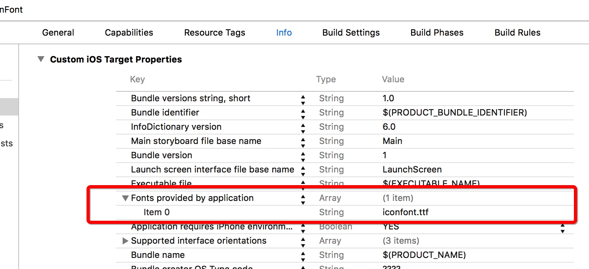
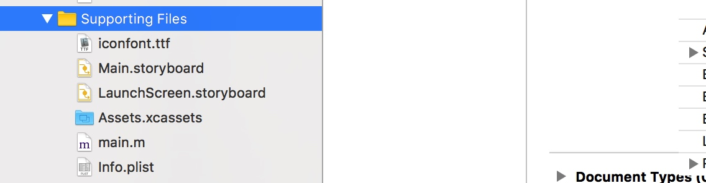
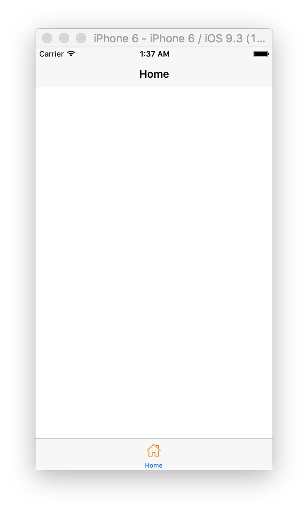

# HDIconFont
##pod 'HDIconFont'
####1.首先引入在plist里面引入ttf文件



####2.然后将iconfont.ttf文件拖进项目中



####3.加载头文件

```objectivec
#import "HDIconFont.h"
```


####4.注册iconfont
```objectivec
//HDIconFont Register
    [[HDIconFont instance] initWithConfig:@{
                                            @(HDFontPath):@"iconfont.ttf",
                                            @(HDFontName):@"iconfont",
                                            @(HDFontString):
                                                @{
                                                    @"tab_home_icon":@"\U0000e603"
                                                    }
                                            }];


```

####5.调用函数
```objectivec
HDIconImageMake(@"tab_home_icon",[UIColor orangeColor],25);
```


####6.效果图



